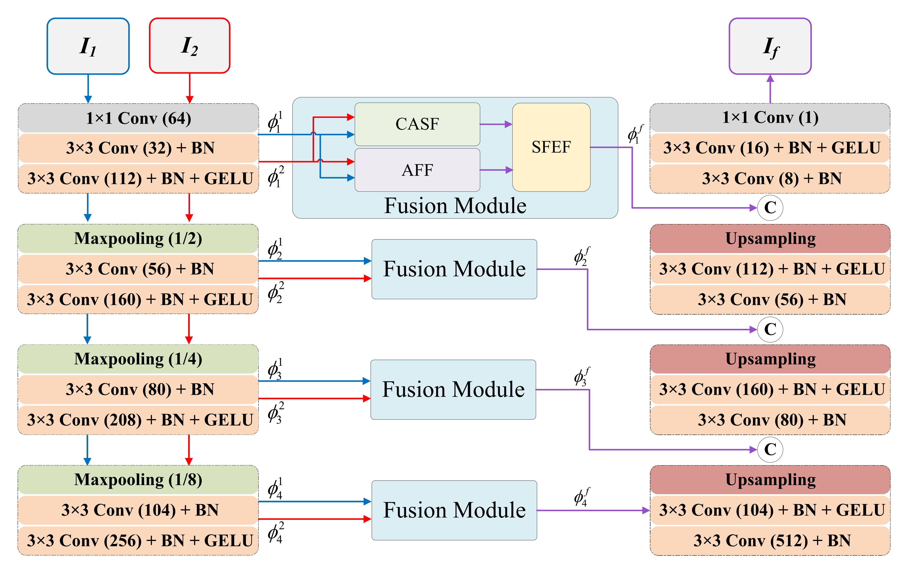
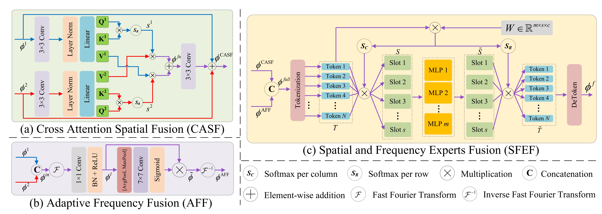

# ASFE-Fusion
Codes for ***Adaptive spatial and frequency experts fusion network for medical image fusion. (Biomedical Signal Processing and Control 2024)***

Xianming Gu<sup>a</sup>, Lihui Wang<sup>a,∗</sup>, Zeyu Deng<sup>a</sup>, Ying Cao<sup>a</sup>, Xingyu Huang<sup>a</sup> and Yue-min Zhu<sup>b</sup>

<sup>a</sup> Engineering Research Center of Text Computing & Cognitive Intelligence, Ministry of Education, Key Laboratory of Intelligent Medical Image Analysis and Precise
Diagnosis of Guizhou Province, State Key Laboratory of Public Big Data, College of Computer Science and Technology, Guizhou University, Guiyang, 550025, China.

<sup>b</sup> University Lyon, INSA Lyon, CNRS, Inserm, IRP Metislab CREATIS UMR5220, U1206, Lyon, 69621, France.

<sup>*</sup> Corresponding author.

-[*[Paper]*](https://www.sciencedirect.com/science/article/abs/pii/S1746809424005366#/)  
-*[Email]*: [xianming_gu@foxmail.com](mailto:xianming_gu@foxmail.com) (X. Gu), [lhwang2@gzu.edu.cn](mailto:lhwang2@gzu.edu.cn) (L. Wang)


## Citation

```
@article{gu2024asfe_fusion,
  title = {Adaptive spatial and frequency experts fusion network for medical image fusion},
  author = {Xianming Gu and Lihui Wang and Zeyu Deng and Ying Cao and Xingyu Huang and Yue-min Zhu},
  journal = {Biomedical Signal Processing and Control},
  volume = {96},
  pages = {106478},
  year = {2024},
  publisher = {Elsevier},
  issn = {1746-8094},
  doi = {https://doi.org/10.1016/j.bspc.2024.106478},
  url = {https://www.sciencedirect.com/science/article/pii/S1746809424005366},
}
```

## Abstract

Multi-modal medical image fusion is essential for the precise clinical diagnosis and surgical navigation since it can merge the complementary information in multi-modalities into a single image. Although existing deep learning-based fusion methods can fully exploit the semantic features of each modality, they cannot fuse them adaptively according to the importance of local and global features of each modality. To address this issue, we propose an adaptive spatial and frequency experts fusion network (ASFE-Fusion) for medical image fusion. Specifically, a cross attention spatial fusion (CASF) module is devised to adaptively fuse local features, which can constraint the consistency in spatial correlations by crossing the self-similarity map between two source images and therefore improve the details of the fused images. To complement the global information that may be lost in the CASF module, adaptive frequency fusion (AFF) module is introduced to fuse the features from a global perspective in frequency domain, which is useful for dealing with issue of intensity distortion. Subsequently, taking the fused features in spatial and frequency domains as two experts, an ensemble-learning-based spatial and frequency experts fusion (SFEF) module is used to adaptively fuse the local and global features. Finally, the fused image can be obtained from the fused features through a decoder by minimizing the content, gradient, and structure loss simultaneously. Extensive comparison experiments demonstrate that the proposed method outperforms state-of-the-art methods in terms of both visual quality and quantitative assessment. In addition, the downstream disease classification task also demonstrates the superiority of the proposed method.

## Usage

### Network Architecture

Our ASFE-Fusion is implemented in ``network.py``.

### Training
**1. Virtual Environment**
```
# create virtual environment
conda create -n asfe_fusion python=3.8
conda activate asfe_fusion
# select pytorch version yourself
# install asfe_fusion requirements
pip install -r requirements.txt
```

**2. Data Preparation**

Download the Havard-Medical-Image-Fusion (HMIF) dataset from [this link](https://github.com/xianming-gu/Havard-Medical-Image-Fusion-Datasets) and place the files of ``'./MyDatasets/'``  in the folder ``'./HMIFDatasets/'``.

**3. ASFE-Fusion Training**

Modify the type and settings of fusion task in ``args_setting.py``.

Run 
```
python train_asfe.py
``` 
and the trained model is available in ``'./modelsave/'``.

### Testing


**1. ASFE-Fusion Testing**

Please put the model in the folder ``'./model_pre/``.

Modify the type and settings of fusion task in ``args_setting.py``

Run 
```
python test_asfe.py
``` 
and the results is available in ``'./result/'``.


## ASFE-Fusion

### Illustration of our ASFE-Fusion model.





### Qualitative fusion results.


